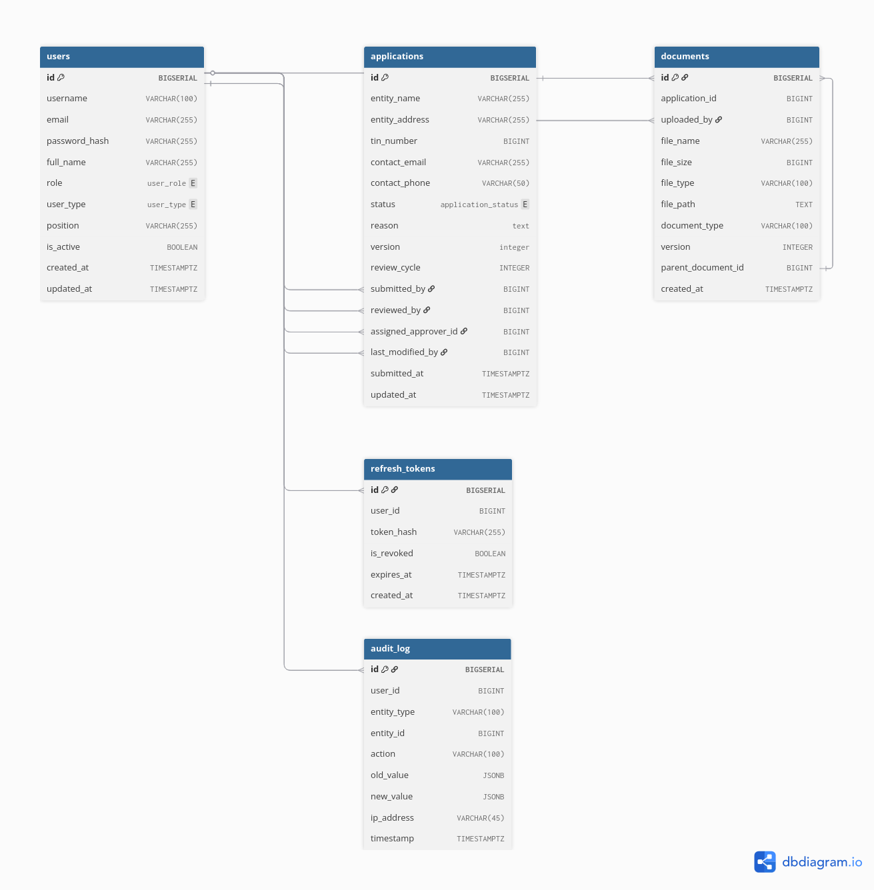
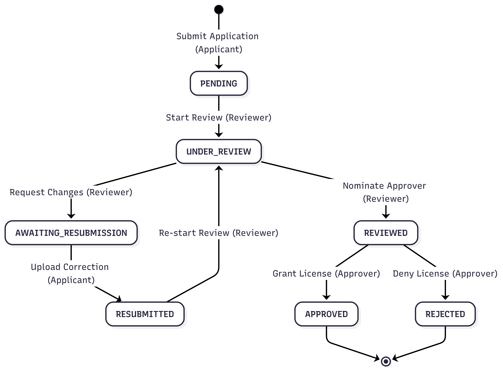
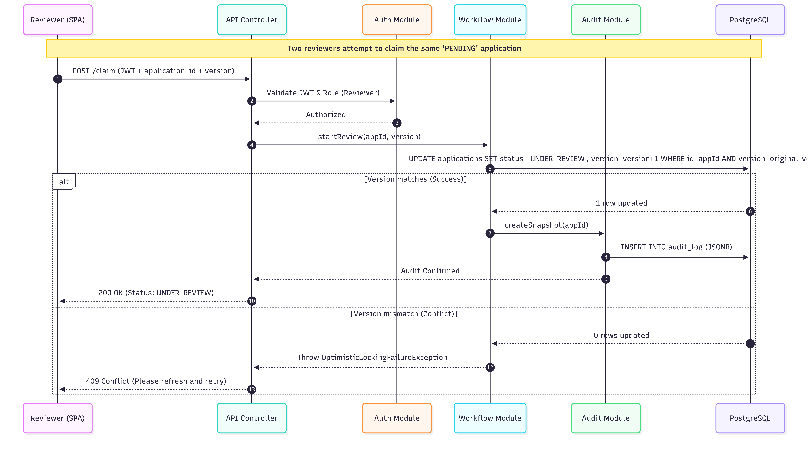

# Bank Licensing & Compliance Portal Design Document

----

## 1. Overview
This system is a workflow engine for bank license applications, built to replace manual email and spreadsheet coordination. 
It enforces a strict state machine, maintains a legal grade immutable audit trail, and manages supporting document versions.
It is deliberately not a distributed system. It is a single node deployment, local filesystem document storage, PostgreSQL as DB, 
no external message broker, no email infrastructure. These are design choices, not omissions; the system is sized to its problem.
It replaces fragmented email based workflows and manual document tracking with a structured, auditable state machine.

## 2. Architecture

**Why modular monolith over distributed:** The problem domain is a single workflow with shared state 
applications move through a state machine, documents are attached to applications, audit entries reference both. 
Distributing these into separate services would require a distributed transaction strategy to maintain 
consistency across state transitions and audit writes. That complexity is not justified at this scale. 
The modular structure keeps concerns separated with clear boundaries, each module has its own package, service layer, 
and repository which provides a clean extraction path if a future requirement genuinely demands it. Developer 
onboarding is also easy: one repository, one database, one deployment unit.

## 3. Data Model

**Users:** holds all principals with a role enum (APPLICANT, REVIEWER, APPROVER, ADMIN) and an active flag. 
The active flag is the deactivation surface, it does not delete the user, because deleting a user would 
orphan audit log entries that reference them. Every historical action must remain attributable to its actor.   
**Applications:** is the central entity. Three nullable foreign keys (applicant, reviewer, approver) reflect the 
progressive assignment model, reviewer and approver are null until assigned. The version field is the 
optimistic locking counter. reason is only populated when status is AWAITING_RESUBMISSION, REJECTED; 
the application layer state machine enforces this.   
**Documents:** uses parent_document_id as a self-referencing FK to chain versions. A null parent_document_id 
indicates a root document (first upload). A non-null value chains back to the document it supersedes. The storage 
path records the filesystem location; the database record is the canonical reference, if a document record exists, 
the file must exist. Filesystem - database sync loss is a known gap documented in design boundaries.  
**Audit Log:** stores full JSON snapshots in before_state and after_state (old_value and new_value (JSONB)). 
The table is INSERT Only at the database permission level. No UPDATE or DELETE is possible 
through the application user. timestamp uses the database server timestamp to prevent client clock manipulation.   
**Refresh Tokens:** stores hashed token values, not plaintext. The revoked flag allows explicit revocation on logout 
or user deactivation without deleting the record, deletion would remove the ability to detect replay of a 
previously valid token.
## 4. State Machine

**Design decisions:** AWAITING_RESUBMISSION and RESUBMITTED are separate states because they represent different actors owning 
the workflow. AWAITING_RESUBMISSION is the applicant's responsibility. RESUBMITTED is the reviewer's responsibility,the resubmission 
needs evaluation before it goes to the approver. The reviewer owns resubmission cycles deliberately: they assessed the original application 
and are best positioned to evaluate whether the resubmission satisfies the request for changes before assigning approver. REJECTED is terminal 
because regulatory rejections in the licensing domain are not partial, a rejected application requires a new application, not a continuation of 
the existing one. APPROVED is terminal for the same reason: an approved license is a closed matter.

## 5. Request Lifecycle 

## 6. Roles & Permissions

| Role | Can Do                                                                                                                                                      | Cannot Do                                                                         |
|------|-------------------------------------------------------------------------------------------------------------------------------------------------------------|-----------------------------------------------------------------------------------|
| **APPLICANT** | Submit application, upload documents, resubmit when requested, view own applications                                                                        | View other applicants' applications, claim review, approve, access admin functions |
| **REVIEWER** | Claim pending applications, complete review, assign approver, re-review resubmissions, view all applications, except claimed application by other reviewers | Approve, reassign other reviewers' applications, deactivate users                 |
| **APPROVER** | Approve, reject                                                               | Claim applications for review, view applications not assigned to them, reassign   |
| **ADMIN** | Reassign reviewer/approver on any application, deactivate users, view all applications and audit logs                                                       | Directly transition application states, submit or resubmit as applicant           |

## 7. Hard Decisions

### 7.1. Authentication, JWT + HTTP-only Refresh Token
**Decision:** Short-lived JWT access tokens (15 minutes) held in memory on the client, paired with long-lived refresh tokens 
stored in HTTP-only cookies and persisted to the database.   
**Why**: Stateless access token validation means no session store, no database hit on every request. The refresh token database row is the revocation surface.  
**Failure mode accepted:** A deactivated user retains valid API access for up to 15 minutes after deactivation, until their access token expires naturally. 
This is acceptable for an internal regulatory tool where the deactivating admin has visibility and the window is bounded and documented. It would not 
be acceptable if access tokens carried financial authorization or if the tool were externally facing.  
**What was given up:** Instant revocation on access tokens. A compromised access token cannot be invalidated before expiry without adding a token denylist, which reintroduces session state.
### 7.2. Concurrency, Optimistic Locking on Application State

**Decision:** A version field on the Applications table combined with an explicit Start Review action. Any write that sends a stale version receives a 409 Conflict. 
The user must retry with the current version.  
**Why:** Prevents silent overwrites two reviewers cannot simultaneously claim the same application without one receiving an explicit conflict signal.   
**What was given up:** Automatic conflict prevention. Users must handle 409 responses and retry explicitly.

### 7.3. Audit Immutability, Database Level Enforcement
**Decision:** Three layer enforcement: INSERT-only database permission for the application user, a PostgreSQL trigger that rejects UPDATE and DELETE on the audit log table, 
and no API surface for mutation.  
**Why:** Application level enforcement is insufficient for a legal grade audit trail. A bug, a compromised service account, or a future developer adding a convenience endpoint 
can defeat application layer only guarantees. Database level enforcement holds even if the application is bypassed entirely.  
**Failure mode accepted:** A database superuser can disable the trigger. This is mitigated by infrastructure level access control superuser credentials are not available 
to the application and should be restricted to database administrators under separate access governance. This is documented rather than solved in code because solving it 
in code is not possible: you cannot protect a database from its own superuser from within the database.  
**What was given up:** Nothing functional. A pure application layer approach would have been simpler to implement but would not meet the legal grade bar.

### 7.4. Audit Format, Full JSON Snapshots
**Decision:** Each audit log entry stores a full JSON snapshot of the entity state at the time of the event, rather than a field level diff.  
**Why:** Any point in time state is retrievable in a single query with no reconstruction logic. A diff based approach requires replaying a chain of changes to answer 
"what did this application look like at step N?" adding query complexity and creating correctness risk if the chain has gaps.   
**Failure mode accepted:** Snapshots consume more storage than diffs. At the scale of a bank licensing portal, hundreds to low thousands of applications per year, this cost is negligible. 
If the system were processing millions of records, the calculus would change.  
**What was given up:** Storage efficiency.

### 2.5. Approver Assignment, Reviewer Nominates
**Decision:** The reviewer explicitly assigns an approver before submitting for approval. Admins can reassign at any time.  
**Why:** Reflects real regulatory routing logic where the reviewer understands which approver has jurisdiction or subject matter ownership. 
An open approver queue would create the approver concurrency problem, multiple approvers seeing the same application; which optimistic locking alone 
does not cleanly solve for the approval step.   
**Failure mode accepted:** If the assigned approver is unavailable (leave, vacance), the application is blocked until an admin reassigns. 
This is a real operational risk. It is mitigated by the admin reassignment endpoint but not eliminated. In a production system, 
a routing timer would close this gap.   
**What was given up:** Approver queue flexibility. A round-robin or load-balanced assignment model is not possible without rearchitecting this decision.
### 2.6. Document Versioning, Self Referencing FK Chain
**Decision:** Documents table has a parent_document_id foreign key pointing to the previous version. All versions are retained permanently. Querying the full version 
history requires a self-join.   
**Why:** Document history is a legal requirement in a licensing context. Overwriting previous versions or using a soft delete approach would make prior state reconstruction ambiguous.
The chain of custody is unambiguous: each document knows exactly what it superseded.   
**Failure mode accepted:** Version queries are more complex than a flat document table. A query for "all versions of document X in chronological order" requires a recursive query. 
This is a known, bounded complexity cost that does not grow with system features only with version depth per document, which is naturally limited by the workflow.  
**What was given up:** Query simplicity.

## 8. Design Boundaries

These are the conditions under which the current design holds, and where it breaks.
**Local filesystem document storage** holds under single node deployment where the application server and storage are co-located. 
It breaks under horizontal scaling (two nodes cannot share a local filesystem). One of The fix might be object storage (S3-compatible). 
This was a deliberate scope decision for a single node internal tool; it is not a production storage strategy.
**Filesystem database sync** is an unresolved gap. If an upload succeeds at the filesystem level but the database transaction rolls back, 
the file exists without a record. If the database record is created but the filesystem write fails, the record references a nonexistent file. 
Neither condition is currently detected or repaired automatically. At this scale with this user volume, manual reconciliation is feasible. 
At production scale, a transactional outbox pattern or atomic storage reference would close this.
**Refresh token storage** in PostgreSQL holds under moderate load. It may breaks under high frequency token refresh at scale because refresh queries 
hit the primary database. Redis with TTL-based expiry is the production approach. At internal portal scale, PostgreSQL is sufficient and avoids 
an additional infrastructure dependency.
**The superuser audit trigger gap** is not solvable in application code. It requires infrastructure level access governance.
**The assigned approver availability gap** is mitigated by Admin reassignment; but this does not eliminate it. A routing timer would close it.
