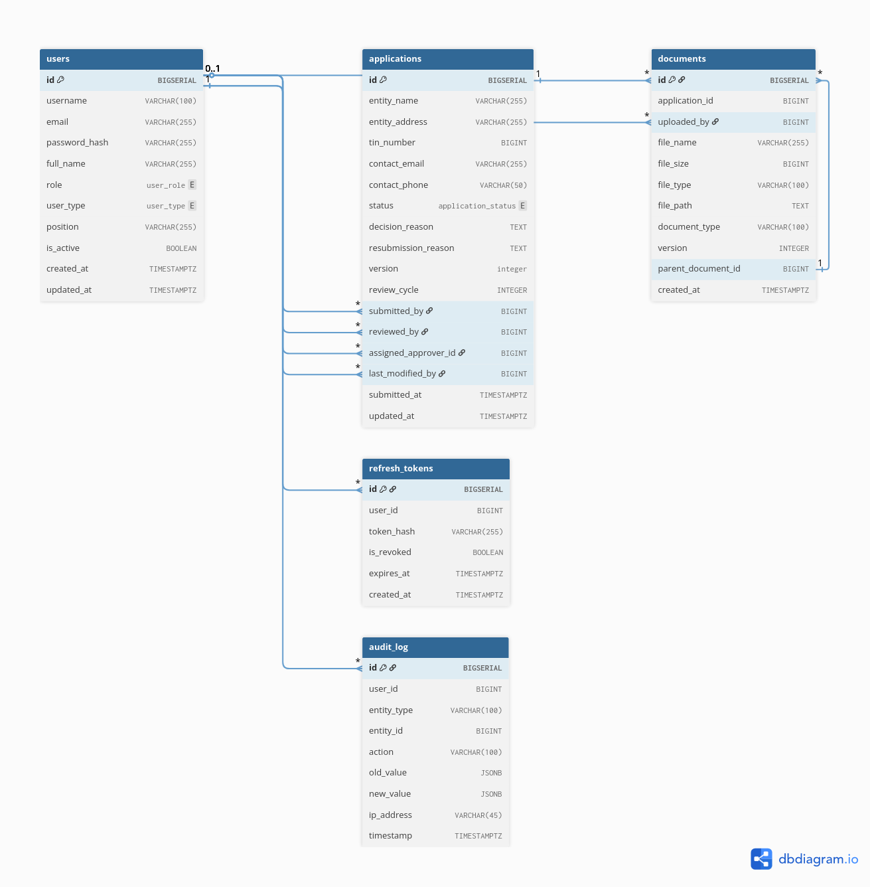

# Bank Licensing & Compliance Portal Design Document

----

## 1. Overview

## 2. Hard Decisions

### 2.1. Authentication, JWT + HTTP-only Refresh Token 

### 2.2. Concurrency, Optimistic Locking on Application State

### 2.3. Audit Immutability, Database Level Enforcement

### 2.4. Audit Format, Full JSON Snapshots

### 2.5. Approver Assignment, Reviewer Nominates

### 2.6. Document Versioning, Self Referencing FK Chain

## 3. Architecture

## 4. Data Model

## 5. State Machine

## 6. Request Lifecycle 

## 7. Roles & Permissions

| Role | Can Do                                                                                                                                                      | Cannot Do                                                                         |
|------|-------------------------------------------------------------------------------------------------------------------------------------------------------------|-----------------------------------------------------------------------------------|
| **APPLICANT** | Submit application, upload documents, resubmit when requested, view own applications                                                                        | View other applicants' applications, claim review, approve, access admin functions |
| **REVIEWER** | Claim pending applications, complete review, assign approver, re-review resubmissions, view all applications, except claimed application by other reviewers | Approve, reassign other reviewers' applications, deactivate users                 |
| **APPROVER** | Approve, reject                                                               | Claim applications for review, view applications not assigned to them, reassign   |
| **ADMIN** | Reassign reviewer/approver on any application, deactivate users, view all applications and audit logs                                                       | Directly transition application states, submit or resubmit as applicant           |

## 8. Design Boundaries
